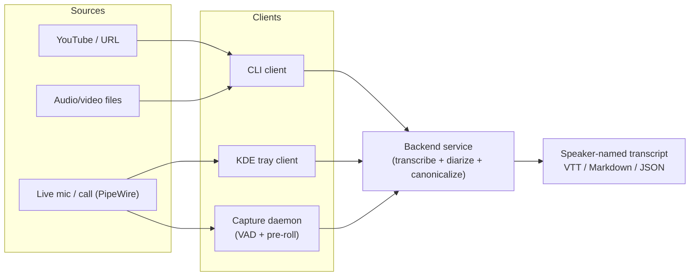
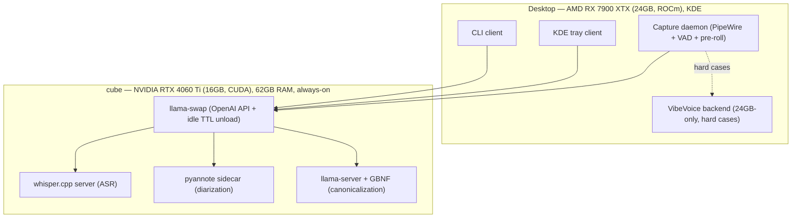

# transcribbler

A **composable, local-first speech transcription + speaker diarization system** for Linux.
One backend service, many thin clients, and a pipeline that turns ambient or
on-demand audio into clean, speaker-attributed, named transcripts — without a
heavy monolithic app you have to babysit.

> Status: **design / architecture phase.** No code yet. The decisions behind this
> system are recorded as ADRs in [`docs/architecture/`](docs/architecture/).

---

## Why this exists

Existing transcription tools fall into two camps, and each fails half of what's needed:

- **Good engines, no awareness** — `speaches`, `whisper.cpp server`, `wyoming-faster-whisper`:
  clean backends, but dumb pipes. Nothing listens to your day; you drive them manually.
- **Good capture, but monolithic** — Hyprnote, Vibe, the Electron "meeting notetaker" crowd:
  they do the always-listening UX, but as heavy apps you must remember to run, with the
  engine welded inside and no Unix-like composability.

**Nobody ships, in Unix-like form, the combination of:** transcription **+ real
diarization + canonicalization**, with **idle GPU release**, an **OpenAI-compatible
API**, and a **thin-client ecosystem including an always-on capture daemon with a
pre-roll buffer and prompt-to-keep.** That gap is what transcribbler fills.

This is a clean-sheet successor to the author's prior `whisper-client` (Rust CLI) and
`whisper-service` (Docker FastAPI backend), keeping their good ideas (thin client,
job queue, silence-aware chunking, YouTube ingest, VTT/markdown output) and discarding
their dead ends (size-driven chunking tied to the OpenAI 25MB limit, naive transcript
reassembly, per-chunk diarization that can't keep speaker identity consistent).

## Goals

1. **Local-first & private.** Audio and transcripts never have to leave your machines.
   A cloud fallback is optional, never required.
2. **Unix-composable.** Small parts that do one thing, talk over clean protocols
   (OpenAI-compatible HTTP, sockets, files you can pipe), and are supervisable by
   `systemd`. No babysat monolith.
3. **One backend, many clients.** A CLI, a KDE system-tray client, and an always-on
   capture daemon are all *thin clients* to the same swappable backend.
4. **Frees the GPU when idle.** Models load on demand and unload after an idle TTL,
   so the GPU is available for games/work between transcription bursts.
5. **Good multi-speaker diarization** that stays consistent across a whole recording,
   with speakers resolved to **names/roles**, not just "Speaker 0".
6. **Runs on the hardware we have** — an NVIDIA/CUDA server *and* an AMD/ROCm desktop.
7. **Better daily coverage.** Capture the conversations of a work-from-home day
   (calls, meetings) with minimal friction.
8. **Operator awareness & control.** Whenever audio is being captured or transcribed,
   there is a clear, always-visible indicator. The operator can explicitly start and
   **stop a transcription session** at any time. Capture is never silent or hidden
   (see [ADR-0010](docs/architecture/0010-operator-awareness-and-control.md)).
9. **Configurable capture cadence.** The same pipeline runs at two granularities
   (see [ADR-0009](docs/architecture/0009-capture-cadence.md)):
   a coarse **session epoch** that closes on extended silence or operator stop (the
   archival, canonical "meeting transcript"), and a fine **turn epoch** — a more
   sensitive silence detector that yields eager, preview-grade per-turn text.

## Non-goals

- Not a hosted SaaS or a multi-tenant product.
- **Not covert.** The system never captures or transcribes without a visible active
  indicator and operator-grantable consent — no hidden/always-silent recording.
- Not a real-time captioning engine first (live preview is a later, lower-fidelity tier;
  the source-of-truth transcript is produced offline). Note: *cadence* (when an epoch
  closes) is a separate axis from *fidelity* (live preview vs offline canonical).
- Not a new inference engine — we **reuse** whisper.cpp / pyannote / llama.cpp and
  invest our effort in the connective tissue that doesn't exist yet.
- Not a single all-in-one GUI application.

## Use cases

1. **Batch transcription (CLI).** Point it at a directory or a YouTube URL; get back
   diarized, named markdown/VTT/JSON. The descendant of `whisper-client`.
2. **Quick desktop dictation/clip (tray).** A KDE tray client to transcribe a selection
   or a quick capture on demand.
3. **Ambient always-on capture (the headline use case).** A daemon watches PipeWire;
   when it heuristically detects a conversation (mic active, Zoom/Chrome running, speech
   via VAD), it's *already* been recording into a ring buffer, and offers
   *"voice detected — keep & transcribe?"* with a few seconds of pre-roll already captured.
   A CLI-only variant does the same with no desktop. While a session is live, a visible
   indicator (tray icon state / CLI status line) shows audio is being transcribed, and
   the operator can stop the session at any time ([ADR-0010](docs/architecture/0010-operator-awareness-and-control.md)).
4. **Eager per-turn capture (cadence variant).** The same daemon run in **turn-epoch**
   mode transcribes each utterance as it lands (sensitive silence detection), instead of
   waiting for a whole session to close — useful for live note-taking where you want text
   to appear turn-by-turn.

## Architecture at a glance

- **Backend** lives on `cube` (CUDA, always-on, idle-unloading). Engine is the
  **llama.cpp family**: `whisper.cpp` (ASR) + `llama-server` with GBNF-constrained JSON
  (canonicalization) + a `pyannote` PyTorch sidecar (diarization), all fronted by
  **llama-swap** for one OpenAI-compatible endpoint with idle GPU release.
- **Clients** live on the **desktop** and are thin and independent.
- **VibeVoice 9B** runs on the desktop's 24GB AMD card as an optional "hard cases"
  backend (long multi-party meetings); both backends converge on the same Canonical IR.

See the diarization + canonicalization pipeline in
[`docs/architecture/0005-diarization-flow.md`](docs/architecture/0005-diarization-flow.md)
and the Canonical IR contract in
[`docs/architecture/0006-canonical-ir-contract.md`](docs/architecture/0006-canonical-ir-contract.md).

## Build order

CLI-daemon-first (see [ADR-0008](docs/architecture/0008-build-order.md)):

1. Backend service on cube (reuse whisper.cpp + pyannote + llama-swap) + Canonical IR.
2. CLI client (batch files + YouTube), the `whisper-client` successor.
3. Canonicalization stage (deterministic stitch + GBNF speaker/term mapping).
4. CLI capture daemon (PipeWire ring buffer + VAD + prompt-to-keep).
5. KDE tray client + desktop heuristics.
6. VibeVoice "hard cases" backend; live-preview tier.

## Hardware

| Machine | GPU | Role |
|---|---|---|
| **desktop** | AMD RX 7900 XTX, 24GB, ROCm (gfx1100); Ryzen 9 9950X3D | Clients, capture, VibeVoice backend |
| **cube** (`aaron@cube`) | NVIDIA RTX 4060 Ti, 16GB, CUDA; 62GB RAM; always-on docker host | Primary backend |

## Prior art & research

The model/tooling research that informed these decisions is preserved in
[`docs/design/prior-art.md`](docs/design/prior-art.md).

## License

Apache-2.0 — see [LICENSE](LICENSE) and [NOTICE](NOTICE).
