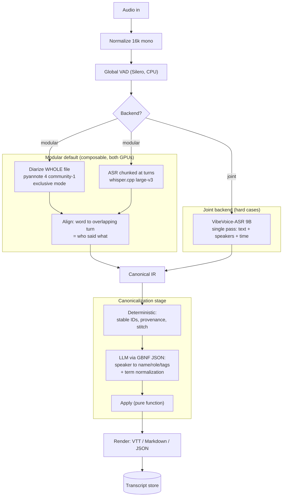

# ADR-0005: Diarization flow — global diarize, chunk ASR, overlap-align

- **Status**: Accepted
- **Date**: 2026-06-28
- **Deciders**: Aaron

## Context

Diarization is the heart of the system, and the prior `nemo-diariziation` experiment
(NVIDIA Sortformer) was a dead end: capped at **4 speakers** and **O(n²)** attention that
OOM'd past ~5 minutes on a 16GB card. The old `whisper-service` had **no speaker handling
at all** and reassembled chunks naively (concat text + offset timestamps), with a latent
timestamp-drift bug.

The 2026 diarization landscape (see [prior-art](../design/prior-art.md)) has three families:

| Family | Example (open) | Speakers | Overlap | Streaming | Runs on |
|---|---|---|---|---|---|
| Cascaded / clustering | **pyannote 4.0 community-1** | unlimited | moderate | no | CPU/any GPU |
| End-to-end (EEND→Sortformer) | Streaming Sortformer | capped (4) | best | yes | CUDA/NeMo |
| Joint speech-LLM / SA-ASR | **VibeVoice-ASR 9B** | many | via tokens | no | ≥18GB GPU |

The metric that matters for our use (work calls) is **cpWER ("who said what")**, not raw
DER — joint models win there because they use linguistic context; cascaded models win on
arbitrary speaker counts and composability.

## Decision

**The keystone rule: diarize the whole file globally; chunk only the ASR.** Per-chunk
diarization is what produced inconsistent cross-chunk speaker IDs in the NeMo experiment.
Diarization is light (it was not the OOM culprit — dense ASR attention was), and clustering
needs the global view anyway, so the whole file is diarized at once and stable speaker IDs
fall out for free.

Two interchangeable backends, both converging on the **Canonical IR**
([ADR-0006](0006-canonical-ir-contract.md)):

- **Modular (default):** whisper.cpp ASR (chunked at turn/silence boundaries) + pyannote
  4.0 community-1 (whole-file, **exclusive mode** for clean alignment). Each ASR word is
  assigned to the diarization turn it overlaps most ("who said what"). Composable,
  swappable, runs on both GPUs.
- **Joint (hard cases):** VibeVoice-ASR 9B does ASR + diarization + timestamps in one pass
  (60-min context, no chunking) on the desktop's 24GB card. Replaces the middle steps,
  feeds the same IR.

**Live/always-on mode is two-tier:** a fast streaming preview (Streaming Sortformer /
WhisperLiveKit, lower fidelity, 4-speaker-ok) for immediacy, and an offline re-run of the
modular flow when a segment finalizes to produce the canonical, source-of-truth transcript.

(Source: [`../design/diarization-flow.mmd`](../design/diarization-flow.mmd). Only the
GPU-touching nodes — diarize, ASR, joint — are subject to idle-unload; everything else is
CPU or a small LLM.)

## Consequences

### Good
- Cross-chunk speaker-ID inconsistency is eliminated by construction.
- No O(n²) OOM: ASR is chunked; diarization is light.
- Backend choice is invisible downstream (single IR convergence point).
- Live immediacy without sacrificing archival accuracy.

### Bad / costs
- Whole-file diarization means the canonical transcript is **offline/near-real-time**, not
  instant (accepted; the live tier covers immediacy).
- Alignment has edge cases (word straddling a boundary → majority overlap; overlapped
  speech → secondary speaker tag) handled by deterministic rules in the IR stage.

## Alternatives considered

- **Per-chunk diarization + embedding re-clustering** — needed only when whole-file
  diarization is impossible (true streaming, or audio beyond model limits); kept as a
  fallback, not the default.
- **Joint model as the only backend** — heavier (9B), newer/less proven, harder to swap;
  kept as the specialty path.
- **Streaming Sortformer as primary** — 4-speaker cap and CUDA-bound; relegated to the
  live-preview tier.

## Related

- ADR-0002 (VibeVoice on the 24GB card), ADR-0004 (engines), ADR-0006 (the IR).
