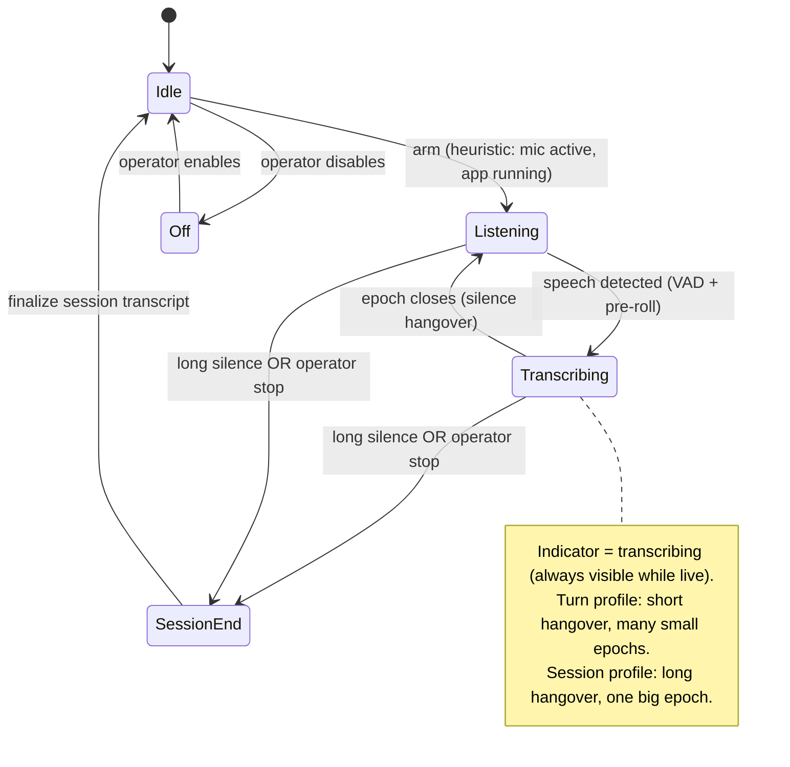

# ADR-0009: Capture cadence (session vs turn epochs) + operator awareness & control

- **Status**: Accepted
- **Date**: 2026-06-28
- **Deciders**: Aaron

## Context

The always-on capture daemon ([ADR-0008](0008-build-order.md) stage 4) needs to decide
*when a span of audio becomes a transcription unit*. Two needs surfaced:

1. **Different cadences.** Sometimes you want one transcript for a whole conversation
   (a meeting), bounded by a long pause or an explicit "I'm done." Other times you want
   eager, best-effort text per **turn/utterance**, appearing as people speak. The operator
   framed these as two modes that are *"basically the same system... but on a more
   sensitive cycle for a new turn or epoch."* — i.e. one mechanism, different sensitivity.

2. **Awareness & control.** An always-listening tool must never capture silently. The
   operator needs a visible indicator that audio is being transcribed, and an explicit way
   to stop a session.

This is a **separate axis** from the fidelity tiers in [ADR-0005](0005-diarization-flow.md):
- **Cadence** (this ADR) = *when* an epoch closes (segmentation in time).
- **Fidelity** (ADR-0005) = *how good* the transcript is (live preview vs offline canonical).
They are orthogonal and compose freely.

## Decision

### The epoch model

Model the capture stream as a sequence of **epochs**. An epoch is the unit that is
transcribed → diarized → canonicalized into one coherent [Canonical IR](0006-canonical-ir-contract.md)
document. An **epoch policy** (a small set of timing parameters) decides when an epoch
closes. Ship two named profiles of the *same* mechanism:

| Profile | Closes an epoch on | Silence sensitivity | Produces |
|---|---|---|---|
| **Session** (coarse) | extended silence **or** operator stop | long hangover (e.g. tens of seconds) | one archival transcript per conversation |
| **Turn** (fine) | brief silence between utterances | short hangover (e.g. ~1 s) | eager per-turn transcripts, low latency |

The profiles differ only in parameters (silence threshold, hangover, min/max epoch
length), so there is one implementation. They **compose hierarchically**: turn epochs may
roll up into the enclosing session (a session is a run of turn epochs bounded by long
silence / operator stop), so you can have both eager per-turn text *and* a consolidated
session transcript from the same capture. (The exact roll-up semantics are an open detail
— see below.)

### Operator awareness & control (hard requirement)

- **Active indicator (always).** Whenever capture/transcription is live, a visible
  indicator reflects state: KDE tray icon state for the GUI client, a status line for the
  CLI/headless daemon. Capture is never silent (a non-goal: *not covert*).
- **Explicit start/stop.** The operator can start and **stop a transcription session** at
  any time (tray action, CLI command, or signal to the daemon). Operator stop is a
  first-class epoch/session boundary, equal to the silence timeout.
- **Indicator states** at minimum: `idle` (armed, not capturing) · `listening`
  (buffering/pre-roll, VAD watching) · `transcribing` (epoch in flight) · `paused/off`.

## Consequences

### Good
- One mechanism, two cadences — no duplicate pipeline; just a parameter profile.
- Cadence and fidelity stay orthogonal, so any cadence works with live-preview or offline.
- Awareness/consent is designed in, not bolted on — addresses the privacy risk of an
  always-listening tool and builds operator trust.
- Operator stop and silence-timeout are unified as "epoch/session boundary" events.

### Bad / costs
- An indicator must be implemented in *every* client surface (tray + CLI), and kept honest
  (it must reflect real capture state, never lie).
- Hierarchical roll-up (turns within a session) adds bookkeeping if both are emitted at
  once; may be deferred.

## Open questions (to confirm before implementing the capture daemon)

- Are session and turn truly **composable** (turn epochs nested in a session, both
  emitted), or are they **mutually-exclusive modes** the operator selects? Current
  decision assumes composable, with mode selection as the common case.
- Default profile for the headline ambient use case (likely **session**, with turn as an
  opt-in for live note-taking).
- Whether operator stop **discards** the current pre-roll/epoch or **finalizes** it.

## Alternatives considered

- **Single fixed cadence** — rejected; the operator explicitly wants both a session
  transcript and an eager per-turn option.
- **Two separate daemons/pipelines** — rejected; it's the same mechanism at different
  sensitivity, so one parameterized implementation is simpler and consistent.
- **Silent capture with retroactive consent only** — rejected; violates the *not covert*
  non-goal. Pre-roll buffering is allowed, but the active indicator is always shown.

## Related

- ADR-0005 (fidelity tiers — orthogonal axis), ADR-0006 (each epoch → one IR doc),
  ADR-0008 (capture daemon is stage 4), ADR-0001 (indicator lives in each thin client).
