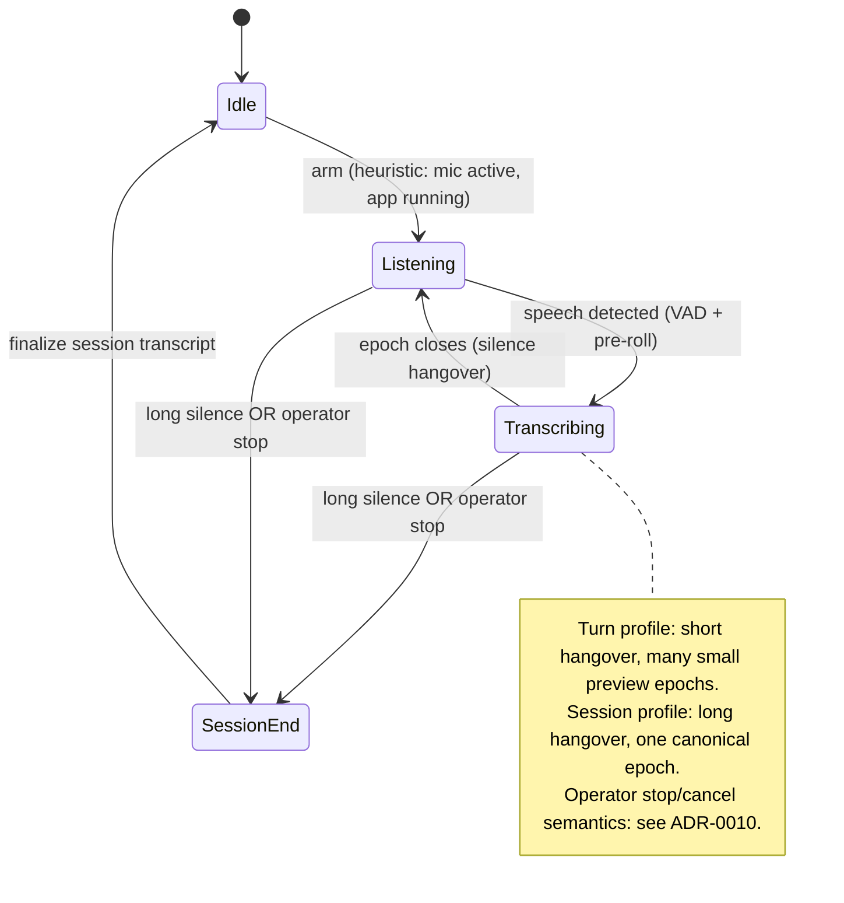

# ADR-0009: Capture cadence — the epoch model (session vs turn)

- **Status**: Accepted
- **Date**: 2026-06-28
- **Deciders**: Aaron
- **Supersedes note**: original draft also covered operator awareness/control; that has
  been split into [ADR-0010](0010-operator-awareness-and-control.md).

## Context

The always-on capture daemon ([ADR-0008](0008-build-order.md) stage 4) must decide *when a
span of audio becomes a transcription unit*. Two granularities are wanted, described as
*"basically the same system... but on a more sensitive cycle for a new turn or epoch"* —
i.e. one mechanism at different silence sensitivity:

- a coarse unit for a whole conversation (a meeting), bounded by a long pause or an
  explicit operator stop;
- a fine, eager unit per **turn/utterance**, transcribed as people speak.

## Decision

### The epoch model

Model the capture stream as a sequence of **epochs**. An **epoch policy** (silence
threshold, hangover, min/max length) decides when an epoch closes. Ship two **profiles of
the same mechanism**:

| Profile | Closes an epoch on | Silence sensitivity | Output |
|---|---|---|---|
| **Session** (coarse) | extended silence **or** operator stop | long hangover (tens of s) | the canonical transcript |
| **Turn** (fine) | brief silence between utterances | short hangover (~1 s) | eager preview text |

The profiles differ only in parameters, so there is one implementation.

### Profiles are exclusive, and map onto the fidelity tiers

The profiles are **selected, not composed** — the operator picks one; we do **not** build a
nested "turn-epochs-inside-a-session" canonical hierarchy.

Cadence and the fidelity tiers of [ADR-0005](0005-diarization-flow.md) are orthogonal *in
concept* but **coupled in this architecture's implementation**, because ADR-0005's keystone
rule is *"diarize the whole file globally."* High-fidelity diarization needs a large
diarization window for stable cross-speaker IDs; the **turn profile's ~1 s cut denies that
window**, which would reintroduce the per-chunk speaker-ID inconsistency that ADR-0005 (and
the NeMo dead-end) exists to kill. Therefore:

- **Session cadence → canonical tier.** Only **session epochs produce a Canonical IR**
  document ([ADR-0006](0006-canonical-ir-contract.md)).
- **Turn cadence → live-preview tier.** Turn epochs are **non-canonical preview
  fragments** (the ADR-0005 live tier: fast, lower-fidelity, may be speaker-capped). They
  are shown, not stored as canonical IR.

"Both at once" (eager text now + a consolidated transcript later) is already provided
correctly by ADR-0005: the live-preview tier *is* the eager per-turn text, and the offline
re-run on session finalize *is* the canonical transcript. No second IR hierarchy is needed.

**Default profile: session** — it matches the headline ambient use case (goal 7,
meeting → archive) and ADR-0005's offline source-of-truth. Turn is opt-in for live
note-taking.

### Epoch lifecycle

## Consequences

### Good
- One mechanism, two cadences — no duplicate pipeline; just a parameter profile.
- Keeps the canonical path on the well-supported global-diarization route; avoids the
  cross-epoch speaker-ID problem by construction.
- Reuses the ADR-0005 tiers rather than inventing a parallel concept.
- The Canonical IR stays ignorant of cadence (no epoch/session IDs leaking into the
  contract) — see [ADR-0006](0006-canonical-ir-contract.md).

### Bad / costs
- "Eager per-turn" output is preview-grade (possibly speaker-capped), not canonical —
  acceptable, and made explicit.
- If true nested canonical roll-up is ever wanted, it needs an IR schema change — deferred
  (see below).

## Resolved (was: open questions)
- **Composable vs exclusive** → exclusive profiles; "both" = preview(turn) + canonical(session).
- **Default profile** → session.
- **Operator stop discard-vs-finalize** → decided in [ADR-0010](0010-operator-awareness-and-control.md).

## Deferred
- **Nested-IR roll-up** (turn epochs as peer canonical docs) would require epoch/session
  identity + a deterministic merge in the IR. Out of scope unless/until needed — would be
  its own ADR. Tracked as a follow-up.

## Alternatives considered
- **Single fixed cadence** — rejected; both a session transcript and eager per-turn are wanted.
- **Composable nested epochs emitting peer canonical IR** — rejected for now; reintroduces
  cross-epoch ID reconciliation and an IR schema burden for no current need.
- **Two separate daemons** — rejected; same mechanism at different sensitivity.

## Related
- ADR-0005 (fidelity tiers; the coupling), ADR-0006 (session epoch → one IR),
  ADR-0010 (awareness & operator stop/cancel), ADR-0008 (capture daemon is stage 4),
  ADR-0011 (idle-unload lease vs live capture).
