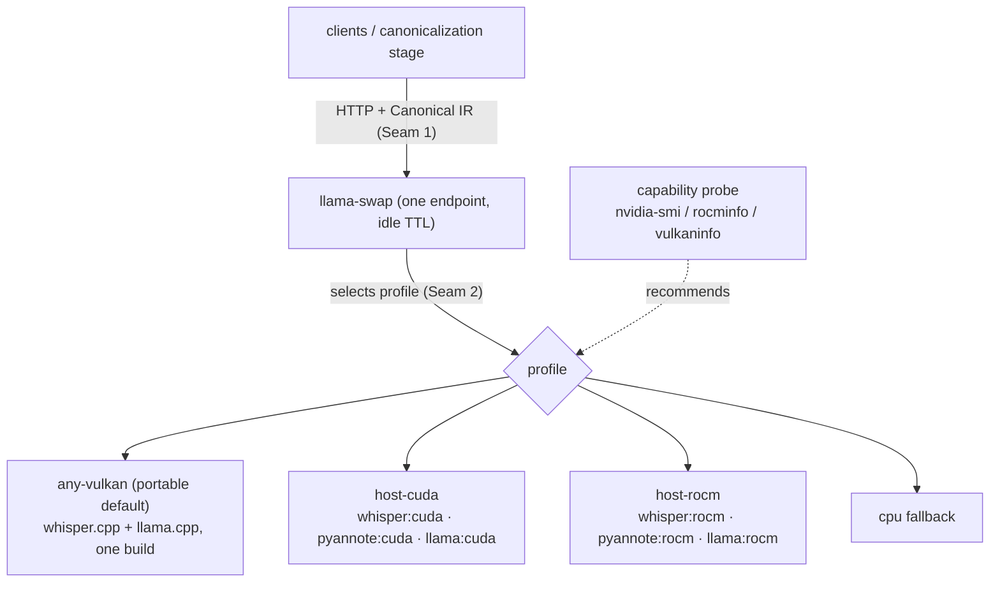

# ADR-0015: Pluggable compute backends — swapping GPUs via wire seam + compute profiles

- **Status**: Accepted
- **Date**: 2026-06-28
- **Deciders**: Aaron

## Context

The core compute (ASR, diarization, the canonicalization LLM) must run across different
GPUs without rewriting clients or the pipeline: an NVIDIA/CUDA host, an AMD/ROCm desktop,
an Intel iGPU, or plain CPU. The hard parts are vendor-specific build complexity
(ROCm vs CUDA wheels, the CTranslate2-ROCm fork, Python-version skew) and the fact that
engines vary in which backends they support. ADR-0002 accepted "two backend builds" and
ADR-0003/0004 made engines swappable behind an OpenAI-compatible endpoint; this ADR turns
that into a concrete portability mechanism.

## Decision

Make compute swappable at **two seams**, and keep all vendor specificity out of clients,
the canonicalization stage, and the Canonical IR.

### Seam 1 — the wire (coarse)

Clients and the canonicalization stage speak **OpenAI-compatible HTTP** and exchange
**Canonical IR** ([ADR-0006](0006-canonical-ir-contract.md)). They have no GPU knowledge.
Switching GPUs can be as simple as pointing a client at a different backend host. This seam
already exists; it is the primary abstraction.

### Seam 2 — the compute profile (fine)

A **compute profile** is declarative data (not code) describing one runnable backend on one
host: per stage (asr / diar / llm) the engine, the **device backend**
(`cuda | rocm | vulkan | cpu`), the model + quantization, a VRAM budget, and the idle TTL.
**llama-swap config is the concrete carrier** ([ADR-0004](0004-llama-cpp-native-backend.md)):
it already maps a model name to a command + args + TTL. Selecting a profile selects the GPU
path. **Adding a GPU = adding a profile, never editing pipeline code.**

### Four levers that make swapping easy

1. **Vulkan-first portable default.** The ggml engines (whisper.cpp, llama.cpp) build for
   Vulkan, which runs on AMD, NVIDIA, and Intel. One build runs everywhere; native
   `cuda`/`rocm` profiles are opt-in *performance*, not a requirement. This is the largest
   portability lever and the default for new hosts.
2. **Per-vendor containers for build-painful stages.** The PyTorch diarizer and any
   CTranslate2-ROCm fork are sealed inside vendor images (`diar:cuda`, `diar:rocm`) behind
   the same port. The profile names the image; vendor build hell never leaks out
   ([ADR-0007](0007-supervisor-agnostic-packaging.md)).
3. **Capability probe.** A small detector (`nvidia-smi` / `rocminfo` / `vulkaninfo` /
   `/dev/dri`) reports the host's GPUs/backends and selects or recommends a profile, so a
   fresh machine self-configures.
4. **Tiny engine-adapter interface.** Engines that aren't HTTP-native (pyannote) sit behind
   a narrow contract — `transcribe(audio) -> IR fragment`, `diarize(audio) -> turns` — with
   the device chosen by config. A new engine is a new adapter; nothing else moves.

### Rule of thumb

Default every host to the **Vulkan-portable** profile so it works on any GPU; offer native
`cuda`/`rocm` profiles where performance justifies the build cost. Vendor specificity lives
only in profiles + containers.

## Consequences

### Good
- Swapping GPUs is config, not code; the IR/clients never change.
- Vulkan gives a single artifact that runs on all three vendors — low-friction default.
- Build complexity is quarantined in per-vendor containers and probed automatically.
- New engines/hardware plug in via a profile + (if needed) a thin adapter.

### Bad / costs
- Vulkan is portable but slower than native CUDA/ROCm for some ops — acceptable as a
  default, with native profiles as the escape hatch.
- Per-vendor containers are extra artifacts to build and maintain.
- The adapter interface must stay narrow or it stops being swappable.

## Alternatives considered
- **Native per-vendor builds only** — best perf, worst portability/build burden; kept as
  opt-in profiles, not the default.
- **One CUDA-only backend** — simplest, but abandons the AMD desktop and Intel paths.
- **Abstract over GPUs in application code** — rejected; reinvents what the wire seam +
  llama-swap already provide, and couples the pipeline to hardware.

## Related
- ADR-0002 (hardware topology), ADR-0003 (swappable engines), ADR-0004 (llama-swap),
  ADR-0006 (IR is GPU-agnostic), ADR-0007 (containers/packaging), ADR-0008 (build order).
