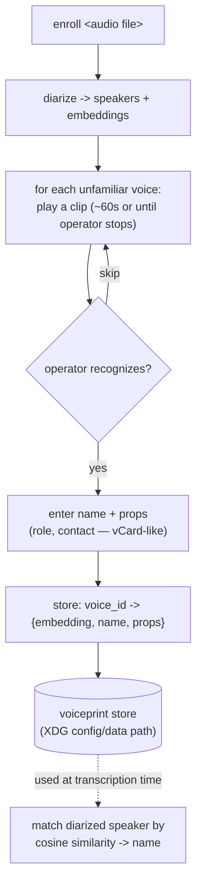

# ADR-0016: Speaker naming strategy — voiceprint enrollment primary

- **Status**: Accepted (strategy); enrollment implementation deferred
- **Date**: 2026-06-29
- **Deciders**: Aaron

## Context

Diarization gives anonymous speakers (`S1`, `S2`). Turning those into real names was
explored three ways this session, and the results reorder the priorities:

- **LLM canonicalization** (ADR-0006): names from *content* (what's said). Built and
  works, but **low yield for high compute** — often 0–1 names per recording, needs a 20GB
  model + (for correct cross-speaker attribution) reasoning (~50s, ~3k tokens), and its
  failure mode is *mis-attribution* (it confidently assigned a name to the wrong speaker),
  which verification can't fully catch. Demoted to opt-in, off by default.
- **Manual**: the Canonical IR keeps names in a separate `speakers[]` table joined by id
  (never in the transcript), so renaming is a **one-row edit**. Cheap, exact, always available.
- **Voiceprint enrollment**: pyannote's `DiarizeOutput` exposes **per-speaker embeddings**
  (we currently discard them). With a store of enrolled voices, diarized speakers can be
  matched to known people **by voice**, deterministically.

The operator's use case is recurring work calls — the *same* handful of people across many
recordings. Naming by *voice* (persistent, deterministic) fits that far better than naming
by *content* (per-recording, content-dependent, fragile).

## Decision

A three-tier naming strategy, in priority order:

1. **Voiceprint enrollment (primary).** Match each diarized speaker's embedding against a
   persistent voiceprint store; assign the enrolled name on a confident match.
   `speakers[].source = "enrolled"`. Deterministic, cheap (embeddings are a diarization
   byproduct), high-yield for recurring people.
2. **Manual (baseline, always).** Operator edits the `speakers[]` table; `source = "manual"`.
   Overrides any automatic naming; the path for one-off or mis-identified speakers.
3. **LLM canonicalization (optional, off by default).** Content-based naming for speakers
   named in-audio when the operator opts in; `source = "llm"`. ADR-0006 stays, demoted.

`speakers[].source` therefore becomes `enrolled | manual | llm | fallback`.

### Enrollment mode (design sketch — not yet built)

Enrollment is a **separate mode**, run when *not* transcribing:

- **Trigger:** an `enroll` subcommand pointed at an audio file. (The file may come from a
  "tee" pattern — capture audio to disk *while* transcribing, so it can be enrolled from later.)
- **Operator loop:** play a clip per unfamiliar speaker (~60s, or until a key is pressed
  once recognized), then capture **name + properties** — a small **vCard-like record**
  (name, role, org, contact) attached to a unique voice id + the embedding.
- **Storage:** an XDG path (e.g. `$XDG_DATA_HOME/transcribbler/voiceprints/`). Builds up
  over time into a reusable identity database.
- **At transcription time:** cosine-match each diarized speaker to the store above a
  threshold → assign name; unmatched → fallback / the operator's best-guess label.
- **Editable later:** records can be corrected/enriched when the operator learns more
  (better name, contact), without touching any transcript.

## Consequences

### Good
- Names recurring people **automatically, deterministically, cheaply** — the right fit for
  the operator's recurring-calls reality, and a fraction of the LLM's compute.
- Mostly "stop discarding data we already compute" (the embeddings).
- The same embeddings also enable speaker **consolidation** (merge over-segmented voices).
- Naming stays decoupled from the transcript (`speakers[]` table), so any tier composes and
  corrections are one-row edits.

### Bad / costs
- A similarity **threshold** to tune; voice drift and channel differences affect matches.
- **Cold start**: unknown people until enrolled; enrollment is operator effort.
- **Biometric privacy**: a voiceprint store is biometric data, and storing *other people's*
  voiceprints raises consent/retention questions — must be handled under
  [ADR-0013](0013-retention-and-consent.md).

## Alternatives considered
- **LLM as primary** — rejected this session: compute/yield/attribution. Kept as opt-in.
- **Manual only** — fine as baseline, but misses the automation enrollment gives for
  recurring speakers.

## Related
- ADR-0006 (IR speakers table + `source`; LLM canon demoted), ADR-0005 (diarization
  provides embeddings), ADR-0013 (biometric privacy/consent), ADR-0014 (embeddings also
  for consolidation).
